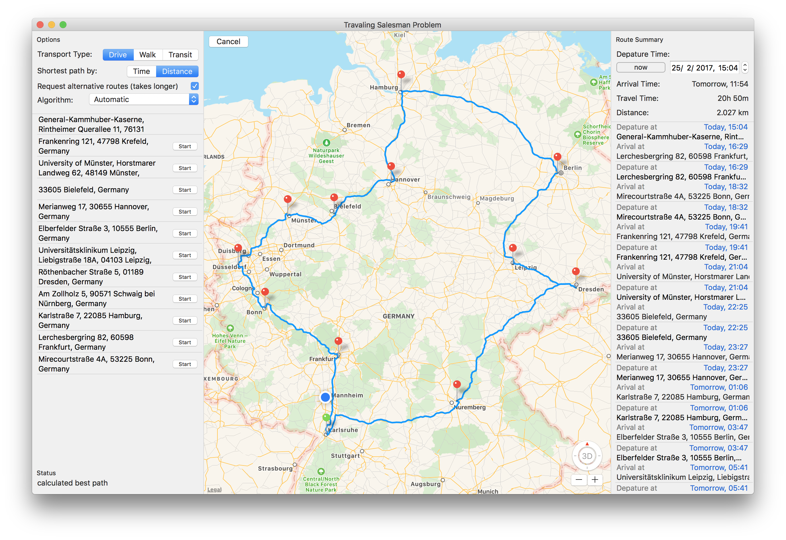
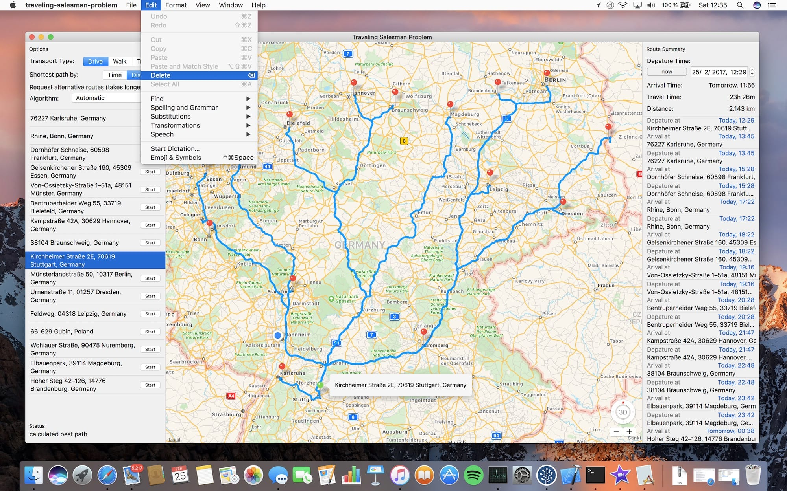

# macOS App written in Swift to find the shortest path
Implementation of different pathfinding algorithms by using a bidirectional and weighted graph data structure `WeightedGraph`. You can find a generic implementation of such a graph struct in `WeightedGraph.swift` and its related protocols.  
This was my first macOS App and it uses only cocoa bindings in the `RouteSummaryViewController`.   
I wrote this App for the [Code Competition "Der Handlungsreisende"](https://www.it-talents.de/foerderung/code-competition/code-competition-02-2017) from [IT-Talents.de](https://www.it-talents.de/).

[Download macOS App (Release v1.0)](https://github.com/dnadoba/traveling-salesman-problem/releases/download/v1.0/traveling-salesman-problem.zip)

Here are some sceenshots and a video to give you a quick overview:

#### Shows all calculated routes

#### Waypoints can be deleted

#### Resolves issues with just a single click

#### Touch Bar support

#### Video in english
[https://www.youtube.com/watch?v=9rd1x_srxYY](https://www.youtube.com/watch?v=9rd1x_srxYY)
#### Video in german:  
[https://www.youtube.com/watch?v=2_piE6WCZNk](https://www.youtube.com/watch?v=2_piE6WCZNk)

Twitter: @dnadoba