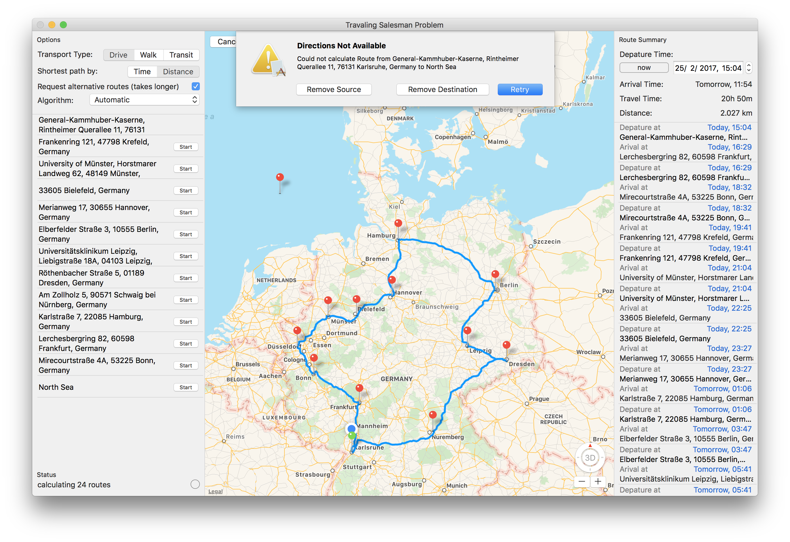

#macOS App in Swift für den Traveling Salesman 
##Der Handlungsreisende
Finde die kürzeste Route und hilf dem Traveling Salesman! 
Wegfindung auf Basis eines bidirektionalen und gewichtetem Graphen. 
Lösung für die Code Competition "Der Handlungsreisende" im Februar 2017 von [IT-Talents.de](https://www.it-talents.de/)

####Detail Ansicht

####Wegpunkte löschbar

####Alle Fehler werden behandelt

####Touch Bar Support

####Video:  
[https://www.youtube.com/watch?v=2_piE6WCZNk&feature=youtu.be]()

Twitter: @dnadoba